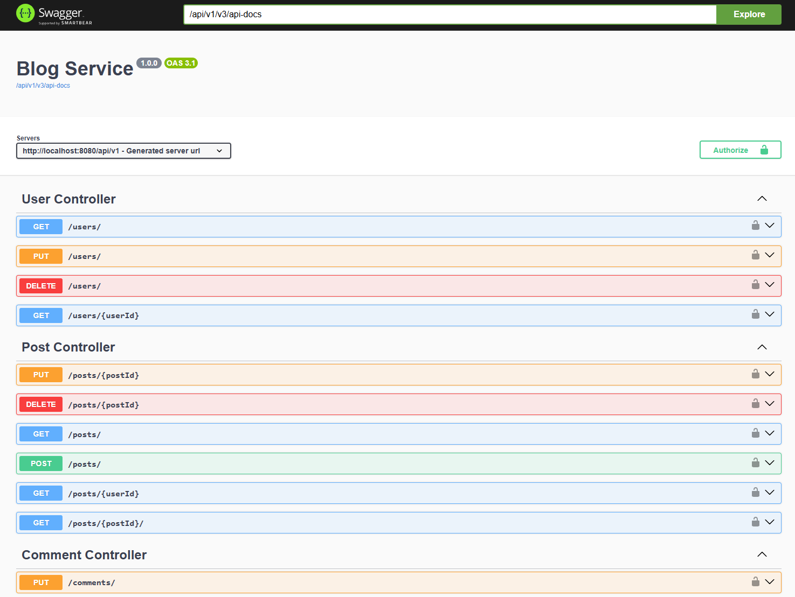

#  Blog Service

---

### Table of Contents

-  [Description](#description)
-  [Installation](#installation)
-  [Testing](#testing)

---

## Description
A **blog platform backend** built with Java and Spring Boot, providing user authentication, post
management, and interaction features.

- **User Management:** Secure registration and login with Spring Security;
- **Post Management:** Create, edit, delete, and fetch blog posts;
- **Reactions/Comments:** Add, edit, delete, update functionality for posts;
- **Persistence:** PostgreSQL database with JPA / Hibernate for ORM;

**Technical stack:** Java 21, Spring Boot, Spring Security, Spring Data JPA, PostgreSQL, Lombok, Docker,
Swagger, JUnit.

---

## Installation
1️⃣ Clone the repository to your local directory:
```bash
    git clone https://github.com/anton1yss/blog-service-java
```

2️⃣ Navigate to the project directory:
```bash
    cd <your-directory-name>
```

3️⃣ Start the Application:
```bash
    docker compose up --build
```
❌ Stop the Application:
```bash
    docker compose down 
```

---

## Testing

Once the App is running, access the **API documentation** through **Swagger UI** at:  
**http://localhost:8080/api/v1/swagger-ui/index.html**




